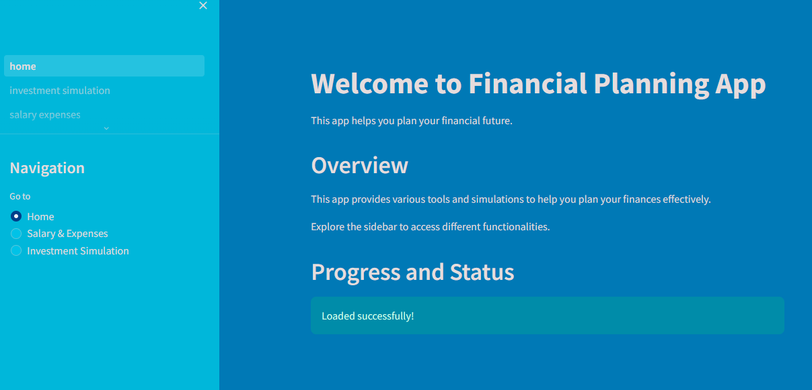

# Financial Planning App



## Objective

The objective of this project is to create a tool that allows users to plan their financial future by calculating their monthly take-home pay after taxes, forecasting salary growth, simulating investment strategies, and providing insights based on projected financial data.

## Features

- Calculate monthly take-home pay after taxes
- Forecast salary growth over time
- Forecast growing expenses due to inflation
- Simulate investment strategies based on projected financial data
- Provide insights and conclusions based on the analysis
- Set up and track financial goals
- Manage debts and track payments
- Personalized dashboard summarizing financial status, upcoming events, and recent activities
- Generate and customize financial reports (PDF, CSV)
- Interactive charts for net worth, investment growth, etc.
- User authentication and registration
- Admin page for user management
- Dark mode and theme customization

## Technologies Used

- Python
- Streamlit
- Numpy
- Pandas
- Plotly
- SQLite
- Streamlit-Authenticator

## Project Structure

The project is organized into multiple directories and Python scripts, each representing a different page or utility of the application:

```
finance-planner/
├── assets/                 # CSS files and other static assets
│   ├── FPA.PNG
│   ├── dark_mode.css
│   ├── light_mode.css
│   ├── modern_theme.css
│   ├── classic_theme.css
│   └── default_theme.css
├── data/                   # Folder for storing data files if needed
│   └── users.db
├── pages/                  # Individual Streamlit pages
│   ├── __init__.py
│   ├── home.py
│   ├── investment_simulation.py
│   ├── salary_expenses.py
│   ├── stock_analysis.py
│   ├── budgeting.py
│   ├── retirement_planning.py
│   ├── debt_management.py
│   ├── goal_tracking.py
│   ├── dashboard.py
│   ├── admin.py
│   └── user.py
├── utils/                  # Utility functions and modules
│   ├── __init__.py
│   ├── calculations.py     # Functions for financial calculations
│   ├── visualizations.py   # Functions for creating plots
│   ├── helpers.py          # Helper functions
│   ├── auth.py             # User authentication module
│   ├── data_storage.py     # Persistent data storage module
│   └── api.py              # API integrations module
├── .env                    # Environment variables
├── .gitignore
├── README.md
├── requirements.txt
├── main.py                 # Main Streamlit app entry point
└── __init__.py
```

## How to Run

1. Clone the repository:

```bash
git clone https://github.com/Mohammed-Mebarek-Mecheter/finance-planner.git
cd finance-planner
```

2. Create a virtual environment and install required dependencies:

```bash
python3.10 -m venv venv
source venv/bin/activate
python3.10 -m pip install -r requirements.txt
```

3. Add your environment variables in `.env`:

```
COURIER_AUTH_TOKEN=your_courier_auth_token
```

4. Create a `config.yaml` file for user credentials:

```yaml
credentials:
  usernames:
    jsmith:
      email: jsmith@gmail.com
      failed_login_attempts: 0
      logged_in: False
      name: John Smith
      password: abc # Will be hashed automatically
    rbriggs:
      email: rbriggs@gmail.com
      failed_login_attempts: 0
      logged_in: False
      name: Rebecca Briggs
      password: def # Will be hashed automatically
cookie:
  expiry_days: 30
  key: some_signature_key
  name: some_cookie_name
pre-authorized:
  emails:
  - melsby@gmail.com
```

5. Run the Streamlit app:

```bash
streamlit run main.py
```

6. You can access the Financial Planning App [here](https://financial-planning.streamlit.app/).

## Authentication

The app uses `streamlit-authenticator` for user authentication. On first run, the app will prompt you to log in or register. Registered users can log in with their credentials, and admins can manage user data from the admin page.

### User Registration

If you do not have an account, you can register by clicking on the "Register" button in the sidebar. Fill in your details, and once registered, you can log in using your credentials.

### Forgot Password

If you forget your password, you can use the "Forgot Password" option to reset it. A new password will be sent to your registered email address.

## Dark Mode and Theme Customization

Users can toggle dark mode and select from different themes via the sidebar for a personalized appearance.

### Dark Mode

To enable dark mode, check the "Dark Mode" option in the sidebar. This will switch the app's appearance to a darker theme, which is easier on the eyes in low-light conditions.

### Theme Customization

Users can select from different themes (Default, Modern, Classic) via the sidebar to customize the appearance of the app. The selected theme will be applied instantly.

## Contributing

Contributions are welcome! Feel free to submit pull requests or open issues for any bugs or feature requests.

## Author

- LinkedIn: [Let's connect](https://www.linkedin.com/in/mohammed-mecheter/)
- Portfolio: [Mebarek](https://mebarek.pages.dev/)

## Contact

For any inquiries or support, please reach out to support@financialplanner.com.

