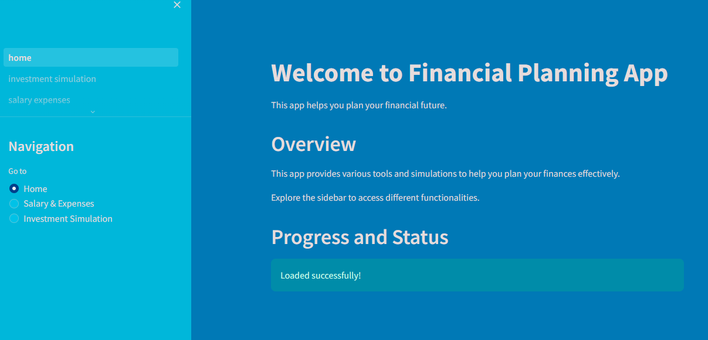

# Financial Planning App



## Objective

The objective of this project is to create a tool that allows users to plan their financial future by calculating their monthly take-home pay after taxes, forecasting salary growth, simulating investment strategies, and providing insights based on projected financial data.

## Features

- Calculate monthly take-home pay after taxes
- Forecast salary growth over time
- Forecast growing expenses due to inflation
- Simulate investment strategies based on projected financial data
- Provide insights and conclusions based on the analysis

## Technologies Used

- Python
- Streamlit
- Numpy
- Matplotlib

## Project Structure

The project is organized into multiple Python scripts, each representing a different page of the application:
- `home.py`: Home page providing an overview of the project.
- `salary_expenses.py`: Page for calculating salary and expenses.
- `investment_simulation.py`: Page for simulating investment strategies.

## How to Run

2. Clone the repository:

```bash
git clone https://github.com/Mohammed-Mebarek-Mecheter/finance-planner.git
cd finance-planner
```

1. Install Streamlit and required dependencies:

```bash
pip install -r requirements.txt
```

3. Run the Streamlit app:

```bash
streamlit run home.py
```

4. You can access the Financial Planning App [here](https://financial-planning.streamlit.app/).

## Contributing

Contributions are welcome! Feel free to submit pull requests or open issues for any bugs or feature requests.

